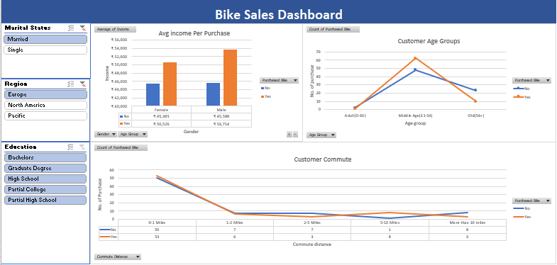

<h1>🚴‍♂️ Bike Sales Dashboard | Excel Data Analytics Project</h1>

  

<b>📘 Overview:</b>

The Bike Sales Dashboard is a professional data analytics project built using Microsoft Excel.

It analyzes customer demographics and purchasing behavior to uncover key insights about bike sales trends, helping businesses understand their target audience and optimize marketing strategies.

This project demonstrates proficiency in data cleaning, pivot tables, and interactive dashboard design, showcasing strong analytical and visualization skills — essential for roles in Data Analytics, Business Intelligence, and Reporting.

<b>🎯 Project Objectives:</b>

Analyze factors influencing bike purchase decisions.

Visualize relationships between income, age, commute distance, and purchase behavior.

Build an interactive Excel dashboard for quick insights and decision-making.

<b>🧾 Dataset Summary:</b>

The dataset contains customer information, including:

Demographics – Gender, Marital Status, Education, Region, Occupation

Economic Factors – Income, Commute Distance

Purchase Decision – Whether a customer purchased a bike

<b>🧰 Tools & Skills Demonstrated:</b>
Category	Skills / Tools:

Data Cleaning	Removing inconsistencies, handling blanks, formatting data

Data Analysis	Pivot Tables, Aggregations, Calculations

Visualization	Pivot Charts, Slicers, Conditional Formatting

Dashboard Design	Interactive filters, clean layout, KPI representation
Soft Skills	Analytical thinking, Data storytelling, Presentation skills

<b>📊 Dashboard Features:</b>

Dynamic Filters (Slicers) for Gender, Region, and Marital Status

Visual Insights such as:

Income vs. Bike Purchase

Commute Distance Distribution

Age Group-wise Purchase Trends

Clean, interactive design optimized for reporting and presentations

<b>🔍 Key Insights:</b>

Higher-income customers are more likely to purchase bikes.

Middle-aged individuals (31–45 years) are the most frequent buyers.

Shorter commute distances correlate with a higher likelihood of owning a bike.

<b>💡 Key Learnings:</b>

Strengthened knowledge of data cleaning and preparation in Excel.

Learned to design interactive dashboards using Pivot Tables and Slicers.

Improved ability to translate data into actionable business insights.

<b>⚙️ How to Use:</b>

Download the file:
Excel Project (Bike Sales Dashboard).xlsx

Open it in Microsoft Excel 2016 or later.

Use slicers to interact with the dashboard and explore different customer segments.

<b>🏷️ Project Type:</b>

Excel | Data Analytics | Dashboard | Visualization | Business Intelligence

### 👤 Author
[**Kazi Umar**](https://github.com/UK183) 
Linkedin profile: https://www.linkedin.com/in/umar-kazi18  
💼 Data Analyst | ML Engineer | Data Science & AI Enthusiast | Power BI | Python | SQL
